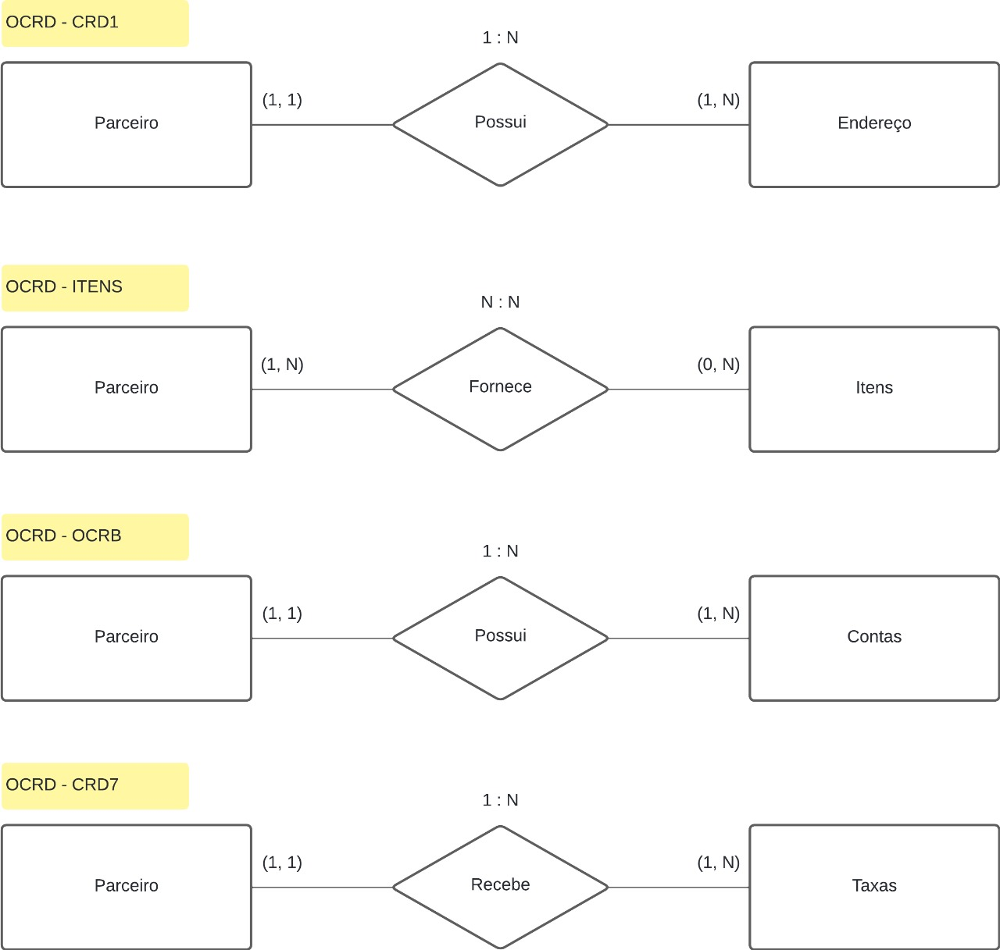

# Diagrama Entidade-Relacionamento

&emsp;&emsp;Um diagrama entidade-relacionamento (ER) é um tipo de fluxograma que ilustra como diferentes "entidades" (como pessoas, objetos ou conceitos) se relacionam entre si dentro de um sistema. Ele é muito utilizado em projetos que contém bancos de dados relacionais, ajudando a visualizar a estrutura e as interações dos dados de forma clara e organizada. Isso facilita a identificação de relações e dependências, permitindo uma melhor gestão e otimização dos sistemas de informação.

&emsp;&emsp;O diagrama foi desenvolvido utilizando a ferramenta LucidChart e será apresentado a seguir:

Imagem 01 - Diagrama Entidade-relacionamento

Fonte: Autoria própria.

&emsp;&emsp;As relações são explicadas a seguir:

1. A primeira relação diz respeito à conexão entre as tabelas OCRD e CRD1. A tabela OCRD é considerada a tabela principal, pois contém as informações dos parceiros. Esta tabela concede o código de usuário (PK) que será utilizado como chave estrangeira nas demais tabelas. Neste caso, ela conecta a chave do parceiro com um ou mais endereços;

2. Na segunda relação, o código do parceiro é utilizado como chave estrangeira na tabela Itens para identificar quais itens são oferecidos por determinados parceiros. Como vários itens podem ser oferecidos por múltiplos parceiros, então existe uma relação N:N;

3. A terceira relação ilustra a conexão entre a tabela OCRD e a tabel OCRB, que possui as informações de contas bancárias dos parceiros;

4. Por fim, a última relaço apresenta a conexão entre a entidade do parceiro com as taxas que são aplicadas em negociações entre o parceiro e a empresa.

