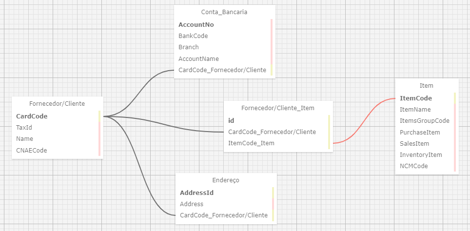

# Tabela em XML

&emsp;&emsp;Um arquivo XML é um formato de texto que utiliza tags para definir a estrutura e o armazenamento de dados de forma hierárquica. Ele é amplamente utilizado para a troca de informações entre sistemas diferentes, pois é facilmente legível tanto por humanos quanto por máquinas.

&emsp;&emsp;Neste caso, para a visualização de tabelas, o XML pode ser usado para estruturar dados de maneira organizada. Por exemplo, cada linha de uma tabela pode ser representada por uma tag específica, e cada célula dentro dessa linha pode ser uma subtag. Isso permite que os dados sejam facilmente interpretados e exibidos em diferentes formatos.

&emsp;&emsp;O arquivo XML, apresentado neste diretório, foi desenvolvido através da plataforma WWW SQL Designer. A seguir, um print das tabelas criadas na plataforma e seus relacionamentos:

Imagem 01 - XML

Fonte: Autoria própria.
